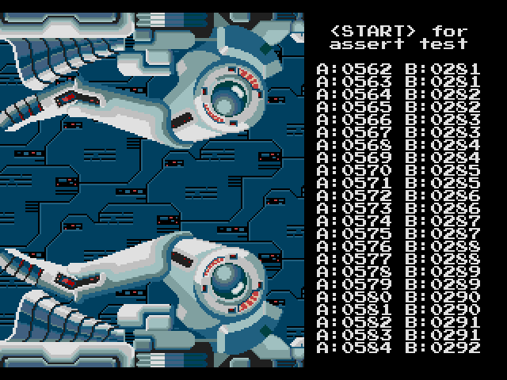
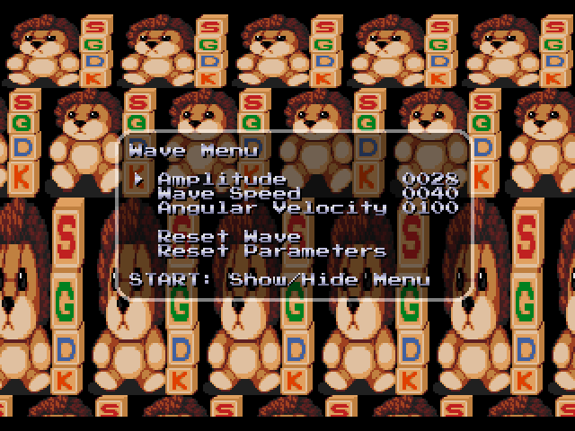

# SEGA Genesis Demos

SEGA Genesis demos made with [SGDK](https://github.com/Stephane-D/SGDK)

## Text Console Demo ([console](console))

A simple TTY style text console.

## Color Fading Test ([fading-test](fading-test))

A color fading test for SGDK.

## Scaling Example ([scaling](scaling))

A code example that demonstrates how to create a pseudo 3D perspective projection of a scrolling plane.

## SEGA Logo Demo ([sega-logo](sega-logo))

A variation of the classic SEGA logo startup sequence featuring a transparent highlight bar.

## Streets of Rage 4 Slideshow ([sor4-slideshow](sor4-slideshow))

A small image slideshow created from screenshots of Streets of Rage 4 with music by Yuzo Koshiro and WING.

## Thunder Force II Intro Sequence ([tf2](tf2))

A Genesis port of the Thunder Force II intro sequence from the X68000 version.

## Screen Wobble Sample ([wobble](wobble))

A sample that shows how to do vertical screen distortions with sine waves.
