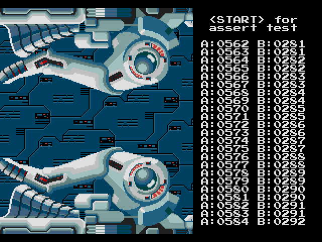

# Text Console Demo

This sample demonstrates how to create a TTY style text console on the Genesis that can be used for debug output on real hardware.

<p align="center">




</p>

Characters are written as a stream, where lines are automatically wrapped if the horizontal border of
the screen is reached. When at the bottom of the screen window, the console content is moved up by one text line and a blank row is inserted. Per default, the console occupies a standad screen of 40x28 tiles. All text attributes, such as font, palette, plane etc., are taken from SGDK text settings. Screen updates are done using DMA transfer mode (which can be changed with `CON_setTransferMethod()`).

One of the use cases are assert messages. To this end, the Genesis state can
be automatically reset before text is displayed.
 
## Console Usage

For easier access all console functions have been collected in a separate module (`console.h` and `console.c`). A text string can be written to the console by simply calling `CON_write()`, which works just like a standard printf() function. For string formatting this makes use of [stb_sprintf](http://github.com/nothings/stb).

```c
int CON_write(const char *fmt, ...)  __attribute__ ((format (printf, 1, 2)));
```

* **fmt** <br> C-string that contains the text to be written. It can optionally contain embedded format specifiers that are replaced by the values specified in subsequent additional arguments and formatted as requested. (See [Printf format string](https://en.wikipedia.org/wiki/Printf_format_string).)

* ***... (additional arguments)*** <br> The function may expect a sequence of additional arguments, each containing a value to be used to replace a format specifier in the format string.

* ***returns*** <br> The total number of characters written is returned. This count does no include the additional null-character automatically appended at the end of the string.


This function also evaluates and executes escape control sequences. The following table lists the control characters that are supported:

| Escape code | Function             |
|-------------|----------------------|
| \\b         | backspace            |
| \\n         | new line (line feed) |
| \\r         | carriage return      |
| \\t         | horizontal tab       |
| \\v         | vertical tab 
 

More details can be found in the [Doxygen documentation](doc/html/index.html).


## Building

With SGDK installed, set `$GDK` as environment variable pointing to your SGDK folder. The demo can then be compiled with:

	make -f $GDK/makefile.gen

Building has been tested with SGDK 1.70 (February 2022).

## Credits

### Text Console Demo

Copyright © 2022 Andreas Dietrich

### STB

Single-file public domain (or MIT licensed) libraries for C/C++

Copyright © 2017 Sean Barrett

### SGDK

[SGDK](https://github.com/Stephane-D/SGDK) SEGA Genesis Development Kit

Copyright © 2022 Stephane Dallongeville

### R-Type

Original graphics:

* Akio
* Yoshige

Copyright © 1987 Irem

Console demo graphics redrawn in Deluxe Paint III by Andreas Dietrich