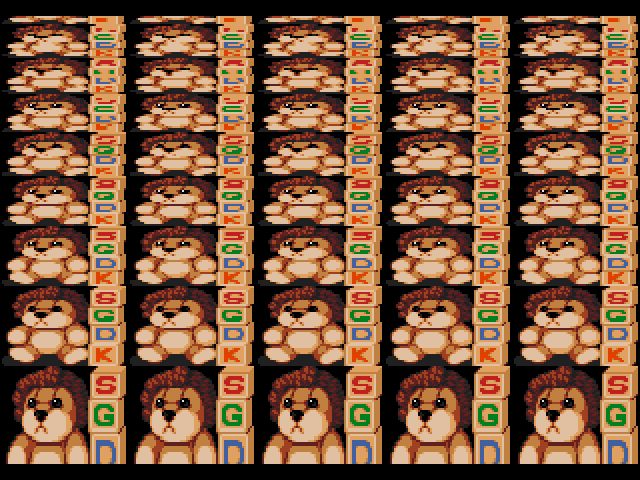

# Scaling Example

This sample demonstrates how to create a pseudo 3D perspective scaling effect as it can, e.g., be seen in games like Axelay on the SNES. The idea is to approximate perspective foreshortening by gradually changing the vertical scaling factor of a texture line by line.

<p align="center">

</p>

On the Genesis, we can make use of it's capability to trigger a horizontal raster interrupt in each scanline. In the interrupt handler we set the vertical background scroll value in a way so that it selects a specific line from a texture for dislay. In the example the code for the horizontal and vertical interrupt handlers looks as follows:

```c
static u8    lineDisplay  = 0;          // line position on display screen
static fix16 lineGraphics = 0;          // line position in graphics texture
static fix16 scroll       = 0;          // scrolling offset
static fix16 scale        = FIX16(4.0); // scaling factor

void HIntHandler()
{
    // Set line to display
    VDP_setVerticalScroll(BG_B, fix16ToInt(lineGraphics) - lineDisplay);

    // Determine next graphics line to display (+1 means image is unscaled)
    lineGraphics += scale;

    // Count raster lines
    lineDisplay++;

    // Decrease scaling factor each line
    scale -= FIX16(0.02);
}
void VIntHandler()
{
    // Make sure HInt always starts with line 0
    lineDisplay = 0;

    // Reset first line we want to display
    lineGraphics = scroll;

    // Decrease scrolling offset, reset after 64 lines
    scroll = (scroll - FIX16(1)) % FIX16(64);

    // Reset scaling factor
    scale = FIX16(4.0);
}
```

There are a few important things that can be seen here:

* We need to count the scanlines HInt is in. This is done with lineDisplay, which counts from 0 to 223, and is reset in VInt.
* lineGraphics specifies in each scanline which graphics line we want to display. If the image is not scaled, this is the same as lineDisplay. If the image size is doubled this would be lineDisplay / 2. If we want a perspective effect the scaling factor needs to be modified each line (scale variable).
* VDP_setVerticalScroll() requires a relative value, so we have to supply lineGraphics - lineDisplay to show a specific line.
* The scaling factor needs to be FIX16 so we can have values < 1 (scale = 0.5 doubles the image size).
* To achieve scrolling, the start value of lineGraphics must be altered each frame. Here we just count down 63, ... 0.

## Building

With SGDK installed, set `$GDK` as environment variable pointing to your SGDK folder. The demo can then be compiled with:

	make -f $GDK/makefile.gen

Building has been tested with SGDK 1.65 (July 2021).

## Credits

### Scaling Example

Andreas Dietrich

### SGDK

[SGDK](https://github.com/Stephane-D/SGDK) SEGA Genesis Development Kit

Copyright © 2021 Stephane Dallongeville
