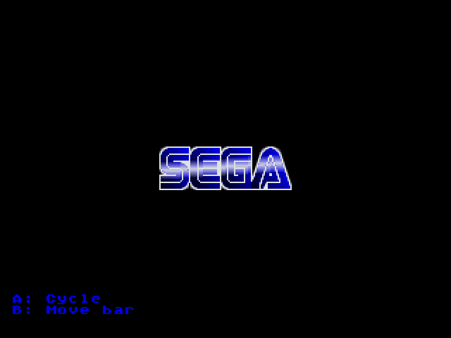

# SEGA Logo Demo

Genesis games typically display a variation of the SEGA logo upon startup. Older games showed the SEGA letter with some simple color cycling. Over time newer games came up with more and more sophisticated effects (e.g., Sonic). So, here is my take on the logo. This example demonstrates the classic blue color cycling, but it is augmented with a transparent moving highlight bar through which the underlying color cycling is visible.

<p align="center">

</p>
 
Since the Mega Drive hardware is very limited when it comes to transparency (there is just a hightlight and shadow mode), transparency with different intensity levels has to be faked. Here, horizontal raster interrupts are used to generate a transparent highlight bar. This is done by setting the vertical scroll value to select a logo version with a specific brightness level per line. In the Gens VDP Plane Explorer you can see the different variations of the SEGA logo:

<p align="center">

</p>

If in two-tile scrolling mode, we can exploit this further to tilt the highlight bar a little. I've been experimenting with writing multiple values to VSRAM in the HInt routine each scanline in order to set vertical scroll values for a number of two-tile columns. Unlike the [scaling](../scaling) sample (which uses plain C code), this example employs 68000 inline assembly to write more than one value to VSRAM:

```c
void HIntHandler()
{
    vu16 *data;
    vu32 *ctrl;

    // Check if we are outside the logo
    const u16 y = lineHInt - 96;
    if (y >= 32)
    {
        // Prime control and data ports
        __asm volatile (
            "   lea     0xC00004,%0;"
            "   move.w  #0x8F04,(%0);"     // Set auto-increment to 4
            "   move.l  #0x401E0010,(%0);" // Set VSRAM address (two-tile column 7)
            : "=>a" (ctrl)
            : "0" (ctrl)
        );

        lineHInt++;
        return;
    }

    // Change vscroll values if inside the logo
    s16 *addr = vScrollBuffer+(y<<3);
   __asm volatile (
        "   lea     0xC00000,%1;"
        "  move.l  (%0)+,(%1);"
        "  move.l  (%0)+,(%1);"
        "  move.l  (%0)+,(%1);"
        "   lea     4(%1),%2;"
        "   move.l  #0x401E0010,(%2);" // Reset VSRAM address (two-tile column 7)
        : "=>a" (addr), "=>a" (data), "=>a" (ctrl)
        : "0" (addr), "1" (data), "2" (ctrl)
    );

    lineHInt++;
}
```

The demo looks OK in most emulators, it also has been tested on real hardware on a PAL MegaDrive 1.

## Building

With SGDK installed, set `$GDK` as environment variable pointing to your SGDK folder. The demo can then be compiled with:

	make -f $GDK/makefile.gen

Building has been tested with SGDK 1.65 (July 2021).

## Credits

### Original SEGA Logo

Copyright © 1976 SEGA Corporation

### SEGA Logo Demo

Andreas Dietrich

### SGDK

[SGDK](https://github.com/Stephane-D/SGDK) SEGA Genesis Development Kit

Copyright © 2021 Stephane Dallongeville
