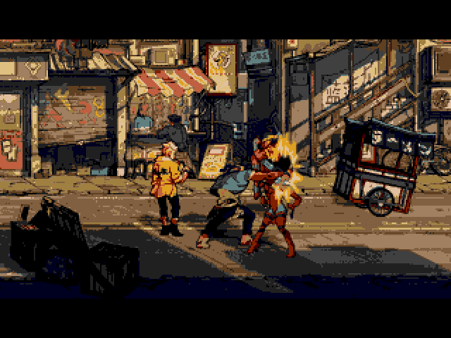

# Streets of Rage 4 SEGA Genesis Slideshow

After having played through Streets of Rage 4, I was curious how it would look on a Mega Drive, so I made a very small slideshow with SGDK using a couple of images I found on Google. Turns out even with 16 colors this does not look so bad. With a more sophisticated tiling and 64 colors it could probably look much better.

As background music a [VGM version of "They're Back"](https://twitter.com/yuzokoshiro/status/1323683056826294277) is included, made by [Yuzo Koshiro](https://twitter.com/yuzokoshiro) and [WING](https://twitter.com/wing_ghost).

## Building

With SGDK installed, set `$GDK` as environment variable pointing to your SGDK folder. The demo can then be compiled with:

	make -f $GDK/makefile.gen

Building has been tested with SGDK 1.65 (July 2021).

## Credits

### Streets of Rage 4

* Artists
  - Ben Fiquet
  - Julian Nguyen You

Copyright © 2020, SEGA, Dotemu

### "They're Back" Mega Drive Version

* Yuzo Koshiro
* WING

### SEGA Genesis Slideshow

Andreas Dietrich

### SGDK

[SGDK](https://github.com/Stephane-D/SGDK) SEGA Genesis Development Kit

Copyright © 2021 Stephane Dallongeville
