# Thunder Force II Intro Sequence

A while ago I learned on Twitter that the Sharp X68000 version of Thunder Force II features an intro (and ending) sequence that is missing in the SEGA Genesis port. So, I gave it a try to port the intro sequence over to the Genesis using [SGDK](https://github.com/Stephane-D/SGDK).

The original game runs on the X68000 in a resolution of 256x256 pixels. Instead of just taking the original images, I decided to use Deluxe Paint (running in an Amiga Emulator) to add additional graphics at the borders. On a PAL Genesis the demo displays graphics at a 320x240 pixels resolution. On an NTSC Genesis (320x228) some pixels at the top and bottom are cropped (left: X68000, right: Genesis).

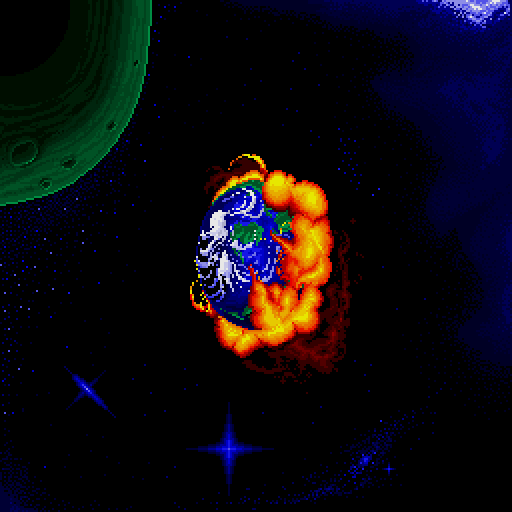 

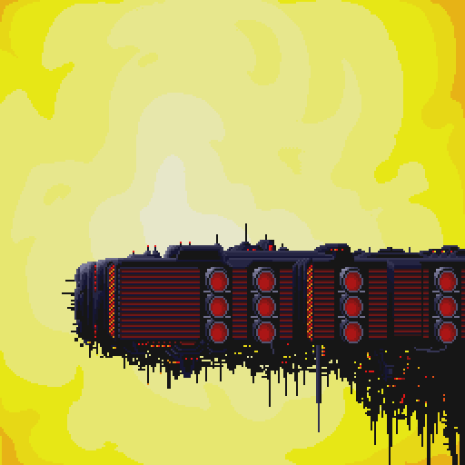 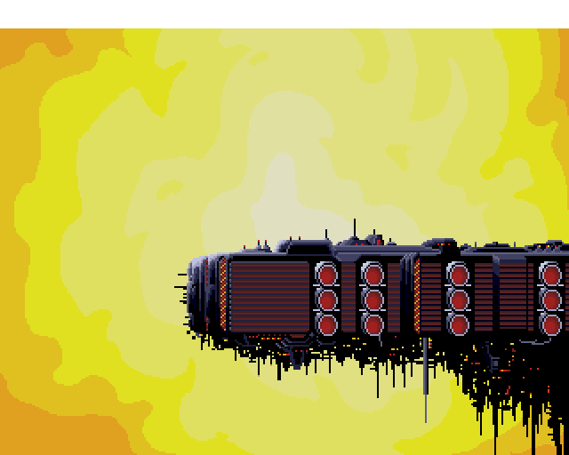

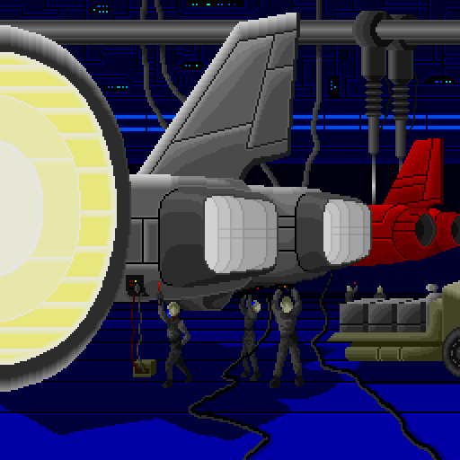 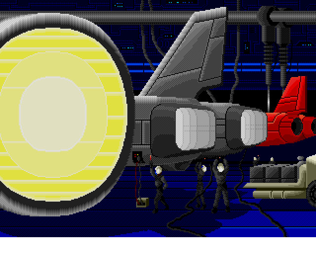

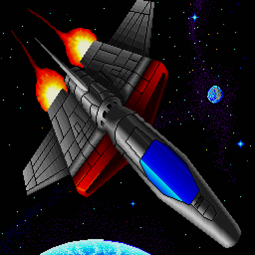 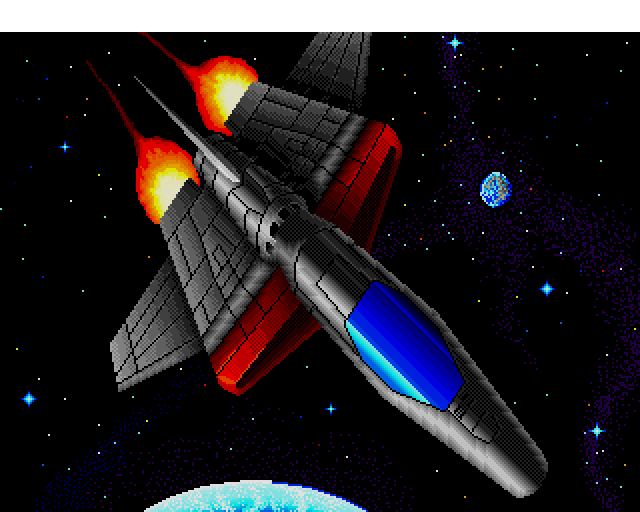

Converting the graphics turned out to be not as straightforward as it first looked, which is because the X68000 not only has a palette of 65536 colors, but also can display more colors simultaneously than the Genesis. To get as close as possible to the original, sprites are used as an extra layer to get around the color limits of Genesis background tiles.

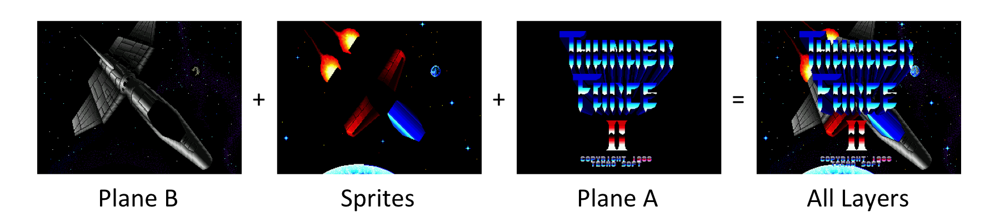

The official Genesis version of Thunder Force II actually does a great job at replicating the original, but I wanted to sees how close we could come to the X68000. The demo title screen uses more colors on screen than the others. To render it, the Genesis code makes use of horizontal raster interrupts, which allow for setting a new color of the text gradient in each scan line.

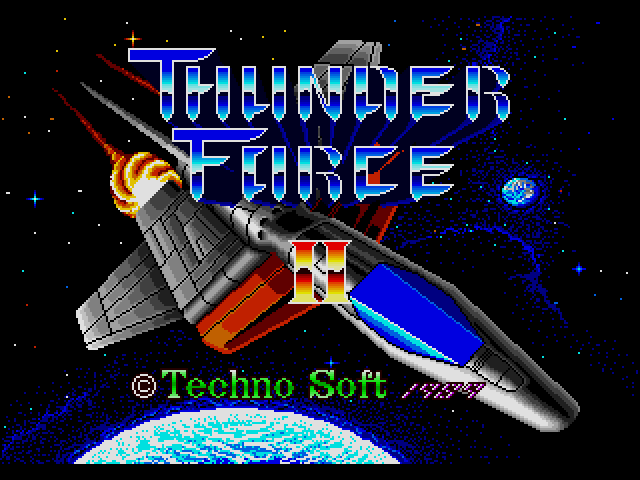
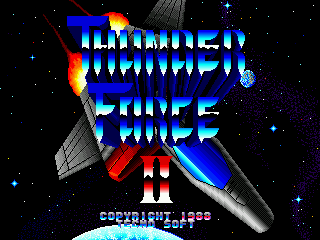

At the moment, the overlay text is only available in Japanese. In case someone would translate it for me, I will also program an English version. 😊

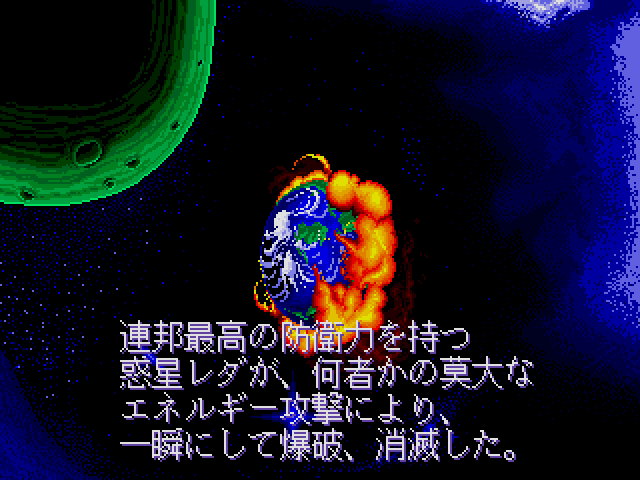

Lastly, the speech samples have be recorded from an emulation of the X68000 version. The background music has been taken from the Genesis version ("The Wind Blew All Day Long" — Opening Theme).

## Building
With SGDK installed, set `$GDK` as environment variable pointing to your SGDK folder. The demo can then be compiled with:

	make -f $GDK/makefile.gen

Building has been tested with SGDK 1.65 (July 2021). It is, however, recommend to use the recent [SGDK](https://github.com/Stephane-D/SGDK) master from GitHub, as it contains a number of fixes that make the demo run more smoothly. The build included in this repository has been built from the SGDK master.

## Credits
### Thunder Force II Sharp X68000 Version

* Programmer
  - Izumi Fukuda
* Artists
  - Osamu Tsujikawa
  - Shinya Shirakawa
* Composer
  - Tomomi Ōtani

### Thunder Force II SEGA Genesis Intro Sequence

Genesis conversion by Andreas Dietrich

### SGDK

[SGDK](https://github.com/Stephane-D/SGDK) SEGA Genesis Development Kit

Copyright © 2021 Stephane Dallongeville
