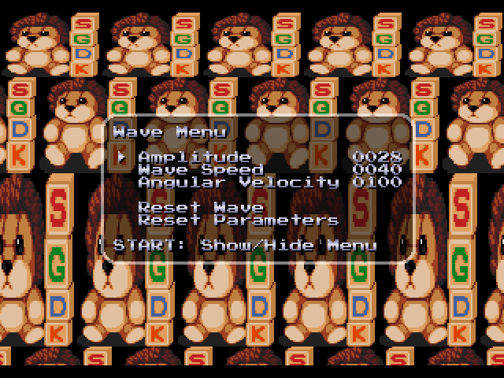

# Screen Wobble Sample

An effect that can be frequenly seen in Mega Drive games is vertical screen distortion, particularly in combination with sine waves (e.g., the startup screen of Vectorman). Like other scaling effects, this is typically achieved by making use of an horizontal interrupt handler that modify the veritical scrolling settings each scanline. Because it is not easy to find good sine function parameters, this demo includes a parameter menu for trying out various settings.

<p align="center">

</p>

The code for the interrupt handlers is actually quite simple, as is only used to select a specific line for display from a parameter buffer:

```c
void HIntHandler()
{
    // Set line to display
    VDP_setVerticalScroll(BG_B, fix16ToInt(lineGraphics) - lineDisplay);

    // Determine next graphics line to display (+1 means image is unscaled)
    lineGraphics += lineBuffer[lineDisplay++];
}
void VIntHandler()
{
    // Make sure HInt always starts with line 0
    lineDisplay = lineGraphics = 0;
}
```

Other interesing parts of the code inlude:

* Applying sine wave functions to fill a parameter buffer for the interrupt handlers (main loop).
* Using sprites to exploit hardware highlight and shadow modes to create a transparent menu backdrop.
* Helper functions for setting up an on-screen menu.
* Loading a custom font based on the classic Atari/Namco arcade font.

## Building

With SGDK installed, set `$GDK` as environment variable pointing to your SGDK folder. The demo can then be compiled with:

	make -f $GDK/makefile.gen

Building has been tested with SGDK 1.65 (July 2021).

## Credits

### Font

Font based on [Press Start](http://www.zone38.net/font/) (originally derived from Gaplus and Legend of Valkyrie).

### Screen Wobble Sample

Andreas Dietrich

### SGDK

[SGDK](https://github.com/Stephane-D/SGDK) SEGA Genesis Development Kit

Copyright © 2021 Stephane Dallongeville
